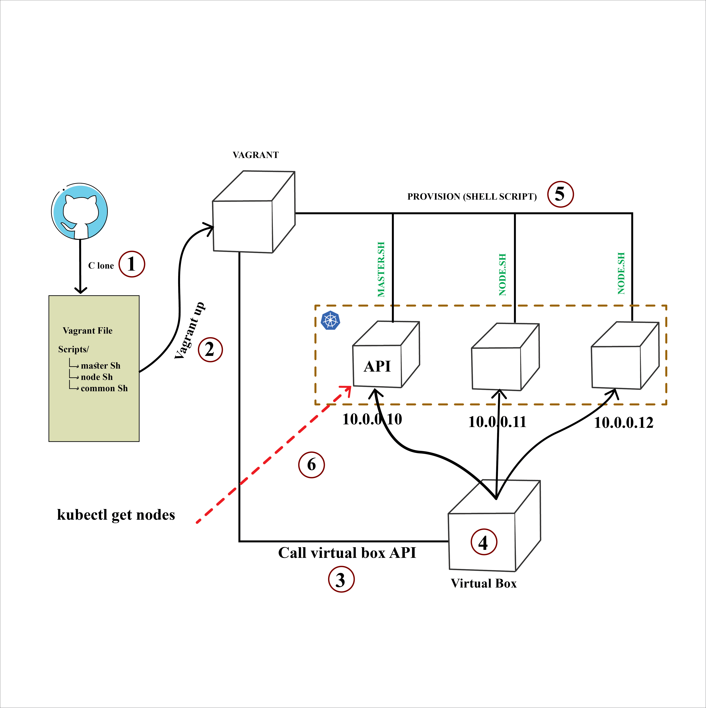
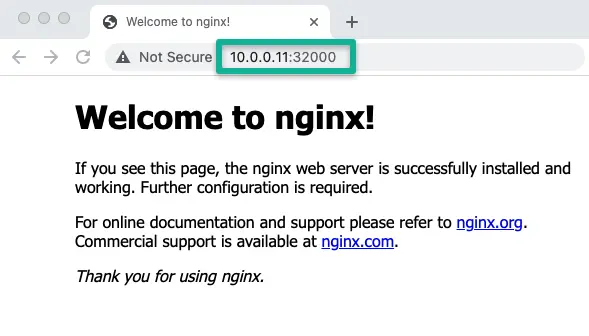
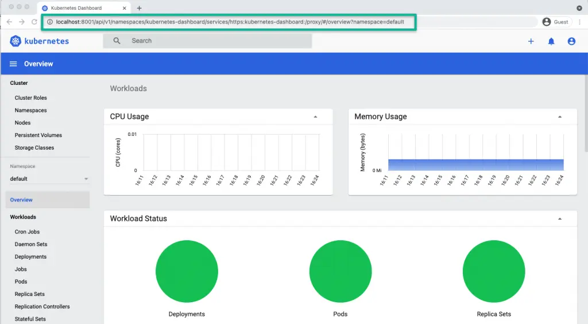

# Task-2

Create 1 master and 2 worker kubernetes cluster using vagrant or lxc/lxd containers. Use
ansible or any configuration management tool of your choice to download kubernetes binaries
and install into those vms/containers. Create a kubeadm config file and use kubeadm to
bootstrap kubernetes cluster using that configuration management tool. You can combine binary
installation and configuration scripts or keep them separate.
Use CNI of your choice but it should be deployed using configuration management scripts
(ansible or other)
Deploy kubernetes dashboard and metric server in this cluster and expose it to nodeport.
Create a service account with the right privilege (provide RBAC file) to access kubernetes
dashboard. Host it into a public git repo with appropriate readme.
Your solution should contain instructions to setup vagrant or lxc/lxd containers.
Your solution should contain ansible or other configuration management tool scripts to install,
configure cluster, cni, deploy dashboard, metric server and create service account with rbac.

## Summary of the setup
- Single vagrant up command will create three VMs and configures all essential kubernetes components and configuration using Kubeadm.
- Calico Network Plugin, Metrics server, and Kubernetes dashboard gets installed as part of the setup.
- The kubeconfig file gets added to all the nodes in the cluster so that you can execute kubectl commands from any node.
- The kubeconfig file and the kubernetes dashboard access token get added to the configs folder where you have the Vagrantfile. You can use the kubeconfig file to connect the cluster from your workstation.
- You can shut down the VMs when not in use and start them again whenever needed. All the cluster configurations remain intact without any issues. The nodes get connected automatically to the master during the startup.
- You can delete all the VMs in one command and recreate the setup with a vagrant up command any time you need.
  
## High-level overview of the setup


Step 1: To create the cluster, first cd into the cloned directory.
Clone the repository to follow along with the guide.
```shell
git clone https://github.com/nizam754/bs_Task-2
```

```shell
cd bs_Task-2
```
Step 2: Execute the vagrant command. It will spin up three nodes. One control plane (master) and two worker nodes. Kubernetes installation and configuration happen through the shell script present in the scripts folder.
```shell
vagrant up
```
Step 3: Log in to the master node to verify the cluster configurations.
```shell
vagrant ssh master
```
Step 4: List all the cluster nodes to ensure the worker nodes are connected to the master and in a ready state.
```shell
kubectl top nodes
```
Step 5: List all the pods in kube-system namespace and ensure it is in a running state.
```shell
kubectl get po -n kube-system
```
Step 6: Deploy a sample Nginx app and see if you can access it over the nodePort.
```shell
kubectl apply -f https://raw.githubusercontent.com/scriptcamp/kubeadm-scripts/main/manifests/sample-app.yaml
```
You should be able to access Nginx on any of the node’s IPs on port 32000. For example, http://10.0.0.11:32000



That’s it! You can start deploying and testing other applications.

To shut down the Kubernetes VMs, execute the halt command.

```shell
vagrant halt
```

Whenever you need the cluster, just execute,
```shell
vagrant up
```
To destroy the VMs,
```shell
vagrant destroy
```
## Access Kubernetes Cluster From Workstation Terminal
Once Vagrant execution is successful, you will see a configs folder with a few files (config, join.sh, and token) inside the cloned repo. These are generated during the run time.

Copy the config file to your $HOME/.kube folder if you want to interact with the cluster from your workstation terminal. You should have kubectl installed on your workstation.

For example, I did the following on my mac keeping vagrant-kubeadm-kubernetes folder as the current directory.

```shell
mkdir -p $HOME/.kube
```
```shell 
cp configs/config $HOME/.kube
```
Alternatively, you can set a Kubeconfig env variable as shown below. Make sure you execute the command from the vagrant-kubeadm-kubernetes folder where you have the Vagrantfile.
```shell
export KUBECONFIG=$(PWD)/configs/config
```
Once you copy the kubeconfig (config) file to your local $HOME/.kube directory you can run the kubectl command against the cluster

Verify the config by listing the cluster nodes.

```shell
kubectl get nodes
```

To access the kubernetes dashboard, run kubectl proxy to access the Kubernetes dashboard.

```shell
kubectl proxy
```
The token file inside the configs folder contains the sign-in token for the kubernetes dashboard. If you want to use the kubernetes dashboard, use the token and log in from the following URL

```shell
http://localhost:8001/api/v1/namespaces/kubernetes-dashboard/services/https:kubernetes-dashboard:/proxy/#/login
```

## Vagrantfile & Scripts Explanation
config and token. The join.sh file has the worker node join command with the token created during kubeadm master node initialization.

Since all the nodes share the folder containing the Vagrantfile, the worker nodes can read the join.sh file and join the master automatically during the first run. It is a one-time task.

Log in to any node and access the /vagrant folder, you will see Vagrantfile and scripts as it is shared between the VMs.

Let’s have a look at the Vagrantfile in the source code repository

As you can see, I have added the following IPs for nodes, and it is added to the host’s file entry of all the nodes with its hostname with a common shell block that gets executed on all the VMs.

- 10.0.0.10 (master)
- 10.0.0.11 (node01)
- 10.0.0.11 (node02)

Also, the worker node block is in a loop. So if you want more than two worker nodes or have only one worker node, you need to replace 2 with the desired number in the loop declaration in the NUM_WORKER_NODES variable. If you add more nodes, ensure you add the IP to the host’s file entry.

For example, for 3 worker nodes, you need to have,

```shell
NUM_WORKER_NODES=3
```
## master.sh, node.sh and common.sh Scripts

The three shell scripts get called as provisioners during the Vagrant run to configure the cluster.

- common.sh: – A self-explanatory list of commands which configures and installs specific version of cri-o runtime, kubeadm, kubectl, and kubelet on all the nodes. Also, disables swap.
- master.sh: – contains commands to initialize master, install the calico plugin, metrics server, and kubernetes dashboard. Also, copies the kube-config, join.sh, and token files to the configs directory.
- node.sh:- reads the join.sh command from the configs shared folder and join the master node. Also, copied the kubeconfig file to /home/vagrant/.kube location to execute kubectl commands.